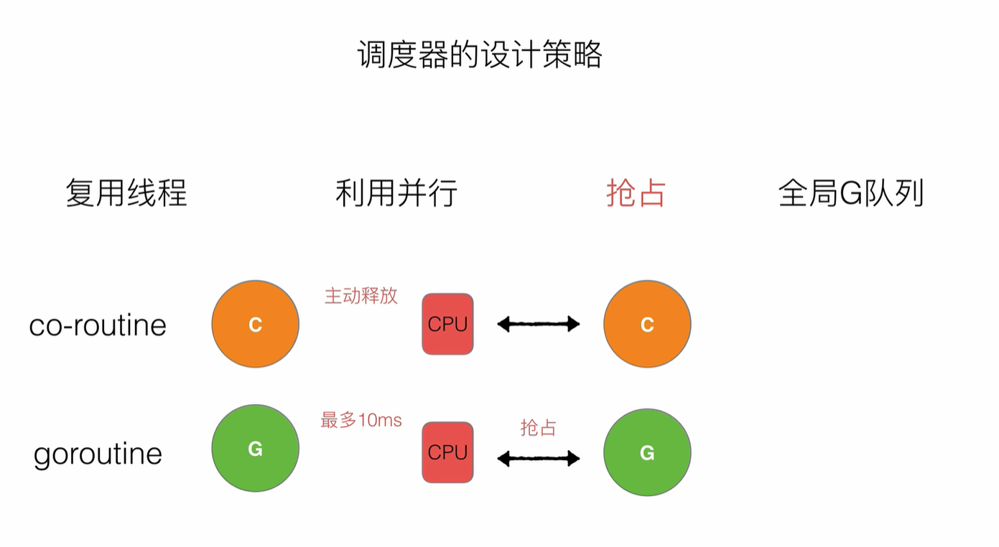

# Golang 深入理解 GPM 模型

[TOC]

## 目标

## 一、调度器的由来和分析

### 1、单进程时代的两个问题

- 单一执行流程、计算机只能一个任务一个任务处理
- 进程阻塞所带来的的 CPU 浪费时间

  

### 2、多进程、多线程的问题

#### 2.1、设计变得复杂(c++、java)

- 进程/线程的数量越多，切换成本就越大，也就越浪费
- 多线程随着同步竞争（如锁、竟争资源冲突等）

#### 2.2、多进程、多线程的壁垒

- 高内存占用

  > 进程占用内存 -> 虚拟内存 4GB(32bit OS)
  >
  > 线程占用内存 -> 约 4MB

  

- 高 CPU 调度消耗

  

### 3、协程(co-routine),引发的问题

#### 3.1、N:1

- 无法利用多个 CPU
- 出现阻塞的瓶颈

#### 3.2、1:1

- 跟多线程/多进程模型无异
- 切换协程成本代价昂责

#### 3.3、M:N

- 能够利用多核
- 过于依赖协程调度器的优化和算法

### 4、调度器的优化

#### 4.1、Goroutine 的优化

- 内存占用
  > 几 KB，可以大量开辟
- 灵活调度
  > 切换成本低

#### 4.2、早期 Go 的调度器

基本的全局 Go 队列和比较传统的轮询利用多个 thread 去调度

##### 4.2.1、弊端

## 二、Gotoutine 调度器的 GMP 模型的设计思想

### 1、GMP 模型的简介

#### 1.1、GMP

#### 1.2、全局队列

存放等待运行的 Goroutine

#### 1.3、P 的本地队列

- 存放等待运行的 Goroutine
- 数量限制 ---> 不超过 25 个
- 优先将新创建的 G 放入 P 的本地队列中，如果满了会放在全局队列中

#### 1.4、P 列表

- 程序启动时创建
- 最多有 GOMAXPROCS 个(可配置)

#### 1.5、M 列表

当前操作系统分配到当前 Go 程序的内核线程数

#### 1.6、P 和 M 的数量

##### 1.6.1、P 的数量问题

- 环境变量$GOMAXPROCS
- 在程序中通过 runtime.GOMAXPROCS()来设置

##### 1.6.2、M 的数量问题

- Go 语言本身限定的 M 的最大量时 10000(忽略、计算机根本不可能运行这么多)
- runtime/debug 包中的 SetMaxThread 函数来设置
- 有一个 M 阻塞,会创建一个新的 M
- 如果有 M 空闲,那么就会回收或睡眠

### 2、调度器的设计策略

#### 2.1、复用线程

避免频繁的创建、销毁线程，而是对线程的复用。

- work stealing 机制
  > 当本地无线程可运行时，尝试从其他线程绑定 P 偷取 G，而不是销毁线程
  > 
- hand off 机制
  > 当本地线程因为 G 进行系统调用阻塞时，线程释放绑定的 P，把 P 转移给其他空闲的线程执行
  > 

#### 2.2、利用并行

GOMAXPROCS 设置 P 的数量，最多有 GOMAXPROCS 个线程分布在多个 CPU 上同时运行。

#### 2.3、抢占

coroutine 中要等待一个协程主动让出 CPU 才执行下一个协程

在 Go 中 goroutine 最多占用 CPU 10ms 防止其他 goroutine 被饿死

#### 2.4、全局 G 队列

当 M 执行 work stealing 从其他 P 偷不到 时，它可以从全局 G 队列获取 G。

### 3、"go func()"经历了什么过程

### 4、调度器的生命周期

### 5、可视化 GMP 编程
